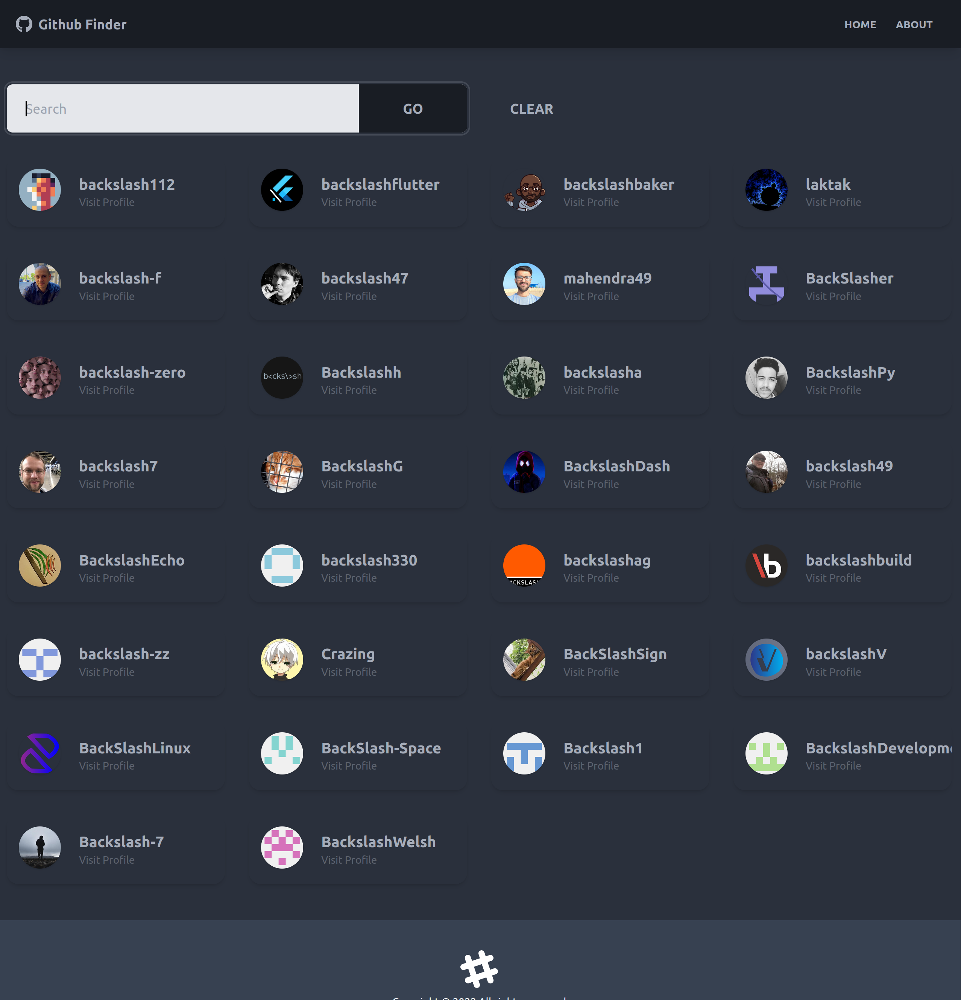
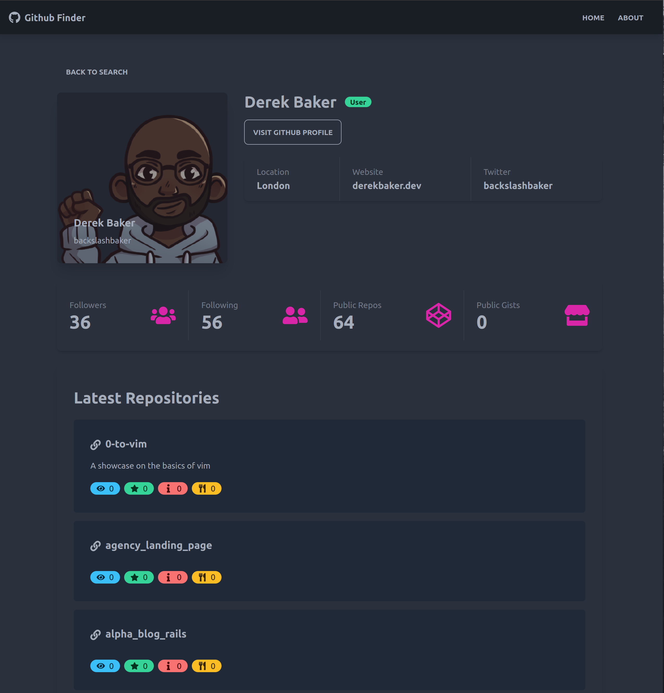

# Github Finder App

App to search Github users and display their info. This is part of the React Front To Back 2022 course by Brad Traversy.




## Deployed version

A deployed version of the project can be found at: https://github-finder-mocha-six.vercel.app/

## Usage

### Install Dependencies

```shell
    npm install
```
This is will install all the necessary dependencies

### Run
```shell
  npm start
```
